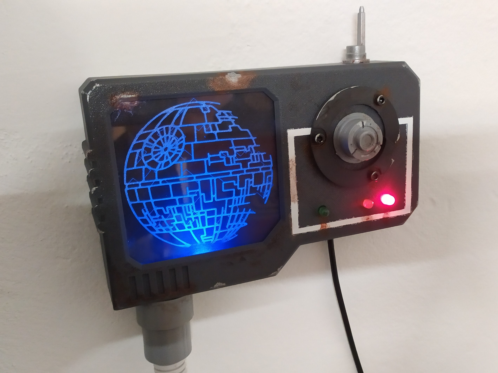
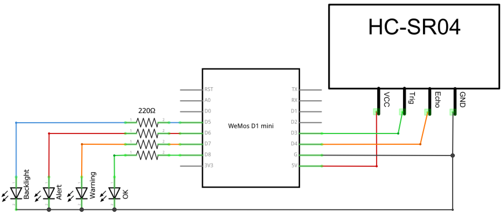

# SmartWater

SmartWater is a microcontroller-based IoT device to measure water level. It uses an ESP8266 microcontroller and a HC-SR04 ultasonic distance sensor to measure water level then send the measured data to [MagicMirror](https://github.com/MichMich/MagicMirror/).

## Features

- Measures the water level (distance) in every five (configurable) seconds.
- Averages the values of 3 (configurable) measurements.
- Filters out extreme (configurable) values.
- Sends the measured data to a remote endpoint (e.g. MagicMirror) via HTTP POST (configurable).
- Has an edge lit acrylic panel to indicate that the device is turned on.
- Has 3 LEDs to indicate the water level (green: OK, yellow: warning, red: alert) with configurable thresholds.
- Does a quick LED test when the device is turned on.
- Generic case that can host a 70×50mm prototype PCB.
- Tons of space for greeblies to customize the case.

## Parts

### Bill of Materials

You need the following parts to build this project:

- 1× Wemos D1 Mini microcontroller
- 1× HC-SR04 ultasonic distance sensor
- 1× 70×50 mm prototype PCB 
- 4× LEDs (blue, red, yellow, green)
- 4× 220 Ω resistors
- Pin headers (if you don't want to solder the cable between the display box and the sensor)
- 4-wire cable to connect the sensor to the microcontroller.
- 4× M1 screws to mount the HC-SR04 sensor into the sensor case. You can also use hot glue.
- 4× M2 screws to mount the PCB to the box
- 4× M3 countersunk screws for the back of the display case
- 3× M3 screws for the lid of the sensor case
- 85×85 mm acrylic case
- Glue
- [Greeblies](https://en.wikipedia.org/wiki/Greeble)

### Electronics

Basically:
- Connect the sensor to the microcontroller directly.
- Connect the LEDs to the microcontroller through the resistors.

### 3D Print

The `3D` folder contains 3D printable files for both the sensor and the display case. No supports needed and you can use 0.3 mm layer height.

I included the original Fusion360 model files, and also exported them to STEP format, so you can modify them to your needs.

I uploaded the [models to Printables](https://www.printables.com/model/417389-sci-fi-project-box) as well, please share your makes there!

### CNC

The case can host a 85×85 mm edge lit acrylic panel. You can carve any drawing to this panel, you can find the source files of the Death Star I used in the `CNC` folder.

### Assembly

1. Assemble the electronics, upload the code, configure and test it.
2. 3D print the cases, CNC carve the acrylic sheet.
3. Mount the PCB inside the display case using M2 screws, and the ultrasonic sensor to the sensor case. Connect them with wires.
4. Glue the acrylic panel into the display case.
5. Glue in the LEDs.
6. Screw the back to the display case and the lid to the sensor case.
7. This is a MUST: Add greeblies and weathering to customize it!

## Software and configuration

You can use the Arduino IDE to open, customize and upload the code in the `SmartWater` folder. The code uses [AutoConnect by Hieromon Ikasamo <hieromon@gmail.com>](https://hieromon.github.io/AutoConnect/index.html) library, so you must install it as a dependency.

The wired pins, threshold levels, measurement parameters, remote endpoint, WiFi SSID and password can be configured at the top of the file. 

You can use the [MMM-SmartWater](https://github.com/balassy/MMM-SmartWater/blob/main/README.md) module to display the measured values in MagicMirror.

## First use

When the device is turned on, it creates a WiFi hotspot, if WiFi connection settings were not configured before. 

**IMPORTANT:** You MUST customize the SSID and password of this temporary WiFi network before uploading the code to your device to prevent malicious usage.

Connect to this WiFi network from your computer or mobile device and let it open the captive portal. The captive portal is served from the microcontroller and will provide a browser based user interface to select your preferred WiFi network and enter your WiFi password.

## Improvements ideas

The single blue LED I used for edge lighting the acrylic panel gives an uneven lighting. It brings the used feeling from a galaxy far, far away, still multiple LEDs or a LED strip would highlight the effect more.

## Acknowledgements

Huge thanks to [Octavi Masià](https://grabcad.com/octavi.masia-1) for creating the Fusion360 model of the HC-SR04 ultasonic sensor and made available in the [GrabCad Library](https://grabcad.com/library/ultrasonic-sensor-hc-sr04-1) for the community. It was a great help when I designed the case for the sensor.

Many thanks to [Michael Teeuw](https://github.com/MichMich) for creating and maintaining the [MagicMirror²](https://github.com/MichMich/MagicMirror/) project fully open source.

Many thanks to [Hieromon Ikasamo](https://github.com/Hieromon) for creating and maintaining the [AutoConnect for ESP8266/ESP32](https://hieromon.github.io/AutoConnect/index.html) library. This library and its wonderful documentation was a huge help for implementing the WiFi connection.

## About the author

This project is created and maintained by [György Balássy](https://www.linkedin.com/in/balassy).
